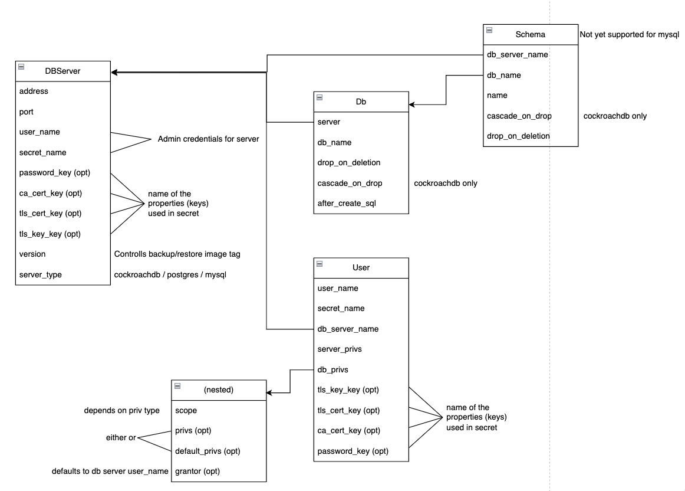
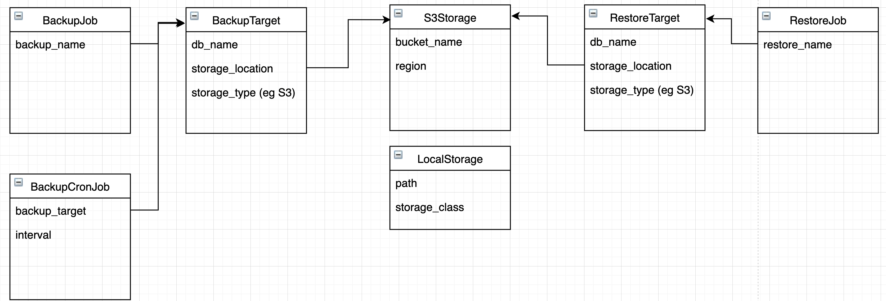
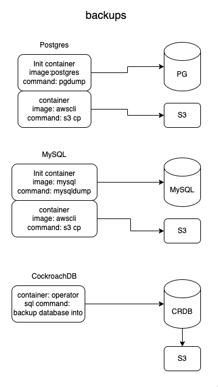

# db-operator

This operator can manage databases, based on kubernetes definitions. It does expect the Server/Cluster to exist already. So it will not and probably will never create an RDS instance. 
What it will do for you:

- DB Backups
- DB Copies
- DB Restores
- Users and Privileges

Why an operator? Can't I just do that in Terraform?

The goal of this operator is to let developers manage their own databases from their own Repository. This works well with a GitOps approach.
The first goal why I started writing these operators is that you can also do Preview Databases on feature branches.

## Design

### Databases Diagram



### Backup Restore Diagram




### Backup stages diagram

This repo uses the original images of postgres or msql to build it's backups.
For CockroachDB we use the internal functionality




## Examples / Kuttl tests

The Kuttl tests are quite good examples of how to implement a feature. You'll have to ignore the assertions of course

| Postgres | CockroachDB | MySQL |
| -------- | ----------- | ------|
| [backup job](tests/postgres/backup-job/) | [backup job](tests/cockroachdb/backup-job/) | [backup job](tests/mysql/backup-job/) |
| [backup cron job](tests/postgres/backup-cron-job/) | [backup cron job](tests/cockroachdb/backup-cron-job/) | [backup cron job](tests/mysql/backup-cron-job/) |
| [restore job](tests/postgres/restore-job/) |  | [restore job](tests/mysql/restore-job/) |
| [restore cron job](tests/postgres/restore-cron-job/) |  | [restore cron job](tests/mysql/restore-cron-job/) |
| [copy job](tests/postgres/copy-job/) |  | [copy job](tests/mysql/copy-job/) |
| [copy cron job](tests/postgres/copy-cron-job/) |  | [copy cron job](tests/mysql/copy-cron-job/) |

### Privileges

Examples from Kuttl tests:

- [Cockroach privileges](tests/cockroachdb/privileges/) of migration user + application user with least privilege access 
- [MySQL privileges](tests/mysql/privileges/) example on how to give SELECT on a table


Privileges are split into:
- Server privileges 
- DB Privileges 
    - DB Scoped
    - Schema Scoped (not implemented for mysql)
    - Table Scoped
    - Default privileges (postgres / cockroachdb) This is required if you want access to tables created in the future

### Postgres / CockroachDB privileges

| Scoped To | Possible Privileges |
| --------- | ------------------- |
| Server | `SUPERUSER, CREATEROLE, CREATEDB, INHERIT, LOGIN, REPLICATION, BYPASSRLS` |
| Database | `CREATE, CONNECT, TEMPORARY (pg only), TEMP (pg only), BACKUP (crdb only), RESTORE (crdb only), ALL` (temp not for cockroachdb) |
| Table | `SELECT, INSERT, UPDATE, DELETE, TRUNCATE, REFERENCES, TRIGGER, BACKUP (crdb only), ALL` |
| Schema | `CREATE, USAGE` |

DbPrivs Examples:

Database:
```yaml
- scope: example-db
  privs: CONNECT
  priv_type: database
```

Schema:
```yaml
- scope: example-db.schema1
  privs: USAGE
  grantor_user_name: migration-user
  priv_type: schema
```

Tables:
```yaml
- scope: example-db
  privs: "/table1:select,delete"
  priv_type: table
```

DefaultPrivs example:
```yaml
- scope: example-db.TABLES
  privs: SELECT,INSERT,UPDATE,DELETE
  grantor_user_name: migration-user
  priv_type: defaultTable
```


### Dev Requirements

- docker
- kind
- kuttl
- golang

### Running tests

Quick way:

```
docker pull postgres:latest
make docker-build
make kind-cluster
make deploy-test-infra
make deploy-kind
make kuttl-test
```

Manually:

```
docker pull postgres:latest
make kind-cluster
make deploy-test-infra
make install
# set up port forwards
# see Running the operator on your machine for dns entries in your hosts file
make kuttl-test-cockroachdb-debugmode
make kuttl-test-mysql-debugmode
make kuttl-test-postgres-debugmode
```

### Building / Packaging

```
# up helm chart version in helm/charts/db-operator/Chart.yaml
# git commit
make docker-buildx
make generate-deploys
# git add new tgz file
# git commit and push
```

### Creating new controllers

```
operator-sdk create api --group db-operator --version v1alpha1 --kind <KIND> --resource --controller
```

### Running the operator on your machine with the resources in Kind cluster

add this line to your `/etc/hosts` file:

```
127.0.0.1	localhost postgres.postgres.svc.cluster.local mysql.mysql.svc.cluster.local cockroachdb-public cockroachdb-public.cockroachdb.svc.cluster.local
```

```
make start-test-cluster
kubectl -n postgres port-forward svc/postgres 5432 &
```

If you want to run as binary
```
make run
```

Vscode:
```
{
    "name": "Debug",
    "type": "go",
    "request": "launch",
    "mode": "debug",
    "program": "${workspaceRoot}"
}
```

If you want to run the test scenario's while you're in debug mode:

```
make deploy-test-yamls-postgres
```

cleanup:

```
kind delete cluster
```