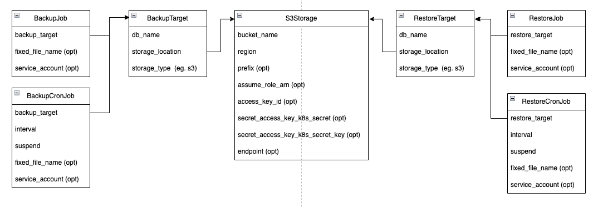

# db-operator

This is a redesign of my first attampt to make a database operator: https://github.com/kabisa/postgresdb-operator

The goal of this operator is to provide databases for preview environments. It expects that there's already a `DbServer` available. This operator does not and (in the foreseable future) will not create Database Servers, RDS instances or absolve you of your DBA duties.

## Why rewrite the old operator?

Mainly:
- Ansible was slow. Every step in Ansible takes quite some time. And there were quite a few steps to go through with ansible. Golang however is a lot faster. Ansible was resource heavy. Golang is lean and nimble.
- I learned that Ansible, and in particular `Yaml`, is not well suited to implement logic. It's great that I didn't have to think about how to apply the required changes in Postgres. But what was really painful was to gather state information and make reconcilation decisions.

But also:
- I wanted a good project to learn Golang
- I believe preview environments are important
- By using the name `DbOperator` I give myself the option to support other Databases as well in the future. For now however, the code does not support different databases.
- I thought it was a cool project to do (still do)

## Design

### Databases Diagram [ready / beta -ish]


### Backup Restore Diagram




### Dev Requirements

- docker
- kind
- kuttl
- golang

### Running tests

Quick way:

```
docker pull postgres:latest
make start-test-cluster
make kuttl-test  # currently only postgres is enabled in these tests
```

Manually:

First disable the cluster creation in kuttl-test-postgres.yaml

```
docker pull postgres:latest
make start-test-cluster
kubectl kuttl test --config kuttl-test-postgres.yaml
```

### Building / Packaging

```
# up helm chart version in helm/charts/db-operator/Chart.yaml
# git commit
make docker-buildx
make generate-deploys
# git add new tgz file
# git commit and push
```

### Creating new controllers

```
operator-sdk create api --group db-operator --version v1alpha1 --kind <KIND> --resource --controller
```

### Running the operator on your machine with the resources in Kind cluster

add this line to your `/etc/hosts` file:

```
127.0.0.1	localhost postgres.postgres.svc.cluster.local mysql.mysql.svc.cluster.local
```

```
make start-test-cluster
kubectl -n postgres port-forward svc/postgres 5432 &
```

If you want to run as binary
```
make run
```

Vscode:
```
{
    "name": "Debug",
    "type": "go",
    "request": "launch",
    "mode": "debug",
    "program": "${workspaceRoot}"
}
```

If you want to run the test scenario's while you're in debug mode:

```
make deploy-test-yamls-postgres
```

cleanup:

```
kind delete cluster
```